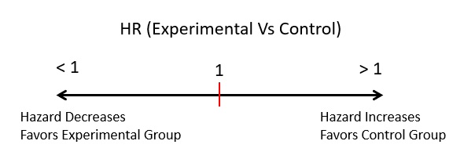

# Survival Analysis 

This Shiny App was developed to easily visualize a survival analysis. 

**Survival analyses** use a set of statistical approaches to investigate the time it takes for an event of interest to occur. The event of interest can be recurrence, remission, progression or death, among others. In Survival studio, two or more groups are compared with respect to the time to this specific event. 
In some cases, the event may not be observed in some individuals within the study time period, then, this observation would be “censored” and survival time would be the last known time the patient or participant was known  not to suffer the event. 

Survival analysis use the following methods:

<details><summary> <b> 1. Keplan-Meier plots </b> </summary>

The Kaplan-Meier plot and it is used to visualize the probability of survival in each of the time intervals.
<p align="center">
  
</p>

</details>

<details><summary> <b>2. Log-Rank Test</b> </summary>

The log-rank test compares the Kaplan-Meier survival curves of both groups. Its H<sub>0</sub> is that survival curves of two populations do not differ.

It is not suitable for continuous predictors. 

</details>

<details><summary> <b>3. Cox Proportional Hazards Regression</b> </summary>

Describes the effect of continuous or categorical predictors on survival. Whereas the log-rank test compares two Kaplan-Meier survival curves (i.e. splitting the population into treatment groups), the Cox proportional hazards models considers other covariates when comparing survival of patients groups. 

The Hazard Ratio (HR):

<p align="center">
  
</p>

</details>

## About the Survival Analysis App

The app has four tabs:

1. Analysis set up: Choose dataset, choose event and time variables, apply filters
2. Table of statistics
3. Keplan-Meier Plot
4. Cox Model

This R Shiny mini-app reads the data from the `data` directory. If you want to work with your own data, just add the desired CSV file to the `data` folder and choose it in the app.

### Checkout and run

You can clone this repository by using the command:

```clone
git clone https://github.com/aridhia/demo-survival-analysis
```
Open the .Rproj file in RStudio and run `runApp()` to run the app.

### Deploying to the workspace

1. Create a new mini-app in the workspace called "survival-app" and delete the folder created for it
2. Download this GitHub repo as a .ZIP file, or zip all the files
3. Upload the .ZIP file to the workspace and upzip it inside a folder called "survival-app"
4. Run the app in your workspace
